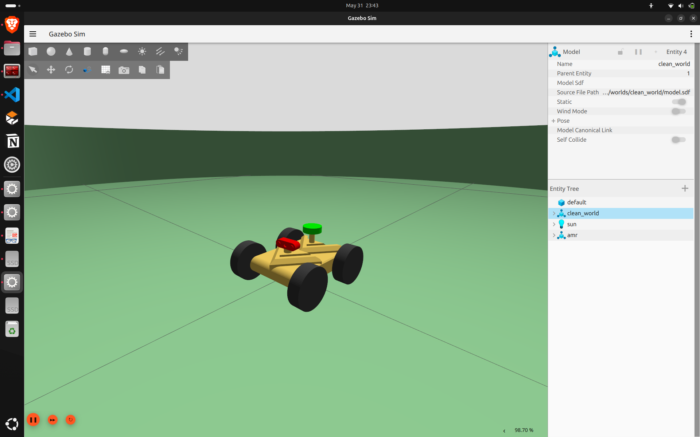
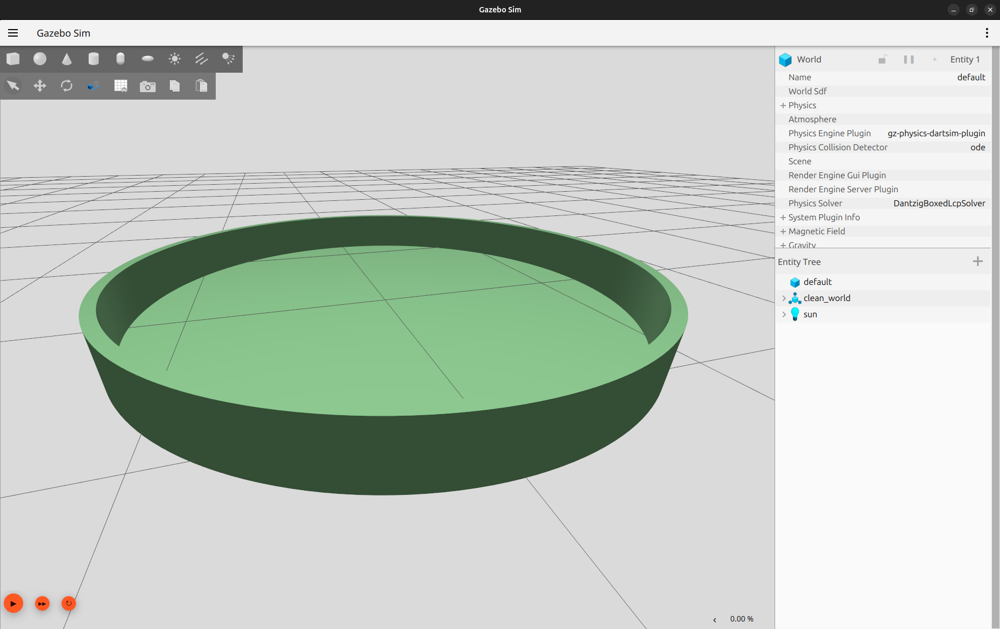
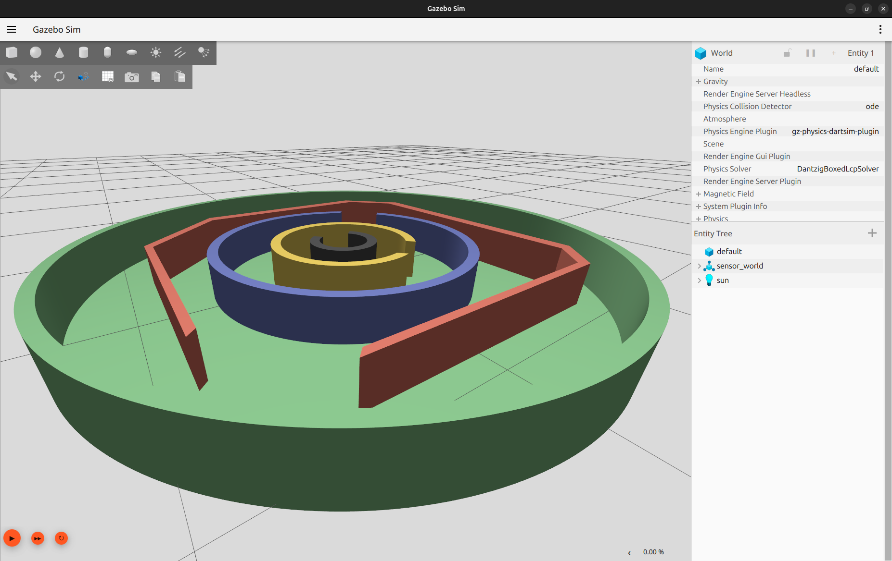
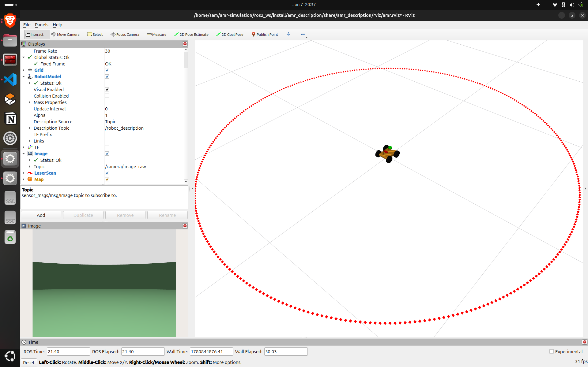

<div align="center">

# 🚀 ROS2 AMR Simulation

A complete **Autonomous Mobile Robot (AMR)** simulation built using **ROS 2 Jazzy** and **Gazebo Harmonic**, featuring differential drive control, LiDAR and camera integration, SLAM, and autonomous navigation.

---

### 🎥 Project Demonstration

[](https://github.com/sam-airobotics/amr-simulation/assets/VIDEO_LINK)

> Click the image above to watch the complete SLAM and Navigation demonstration.

</div>

---

# 📖 Overview

This project demonstrates the complete workflow of building an Autonomous Mobile Robot (AMR) from simulation to autonomous navigation.

The robot has been developed entirely in **ROS 2 Jazzy** and **Gazebo Harmonic**, providing a modular platform for learning and experimenting with modern robotics concepts including:

- Differential Drive Kinematics
- ROS 2 Control
- Sensor Integration
- SLAM (Simultaneous Localization and Mapping)
- Autonomous Navigation
- RViz Visualization
- Gazebo Simulation

The project is intended to serve as a foundation for more advanced autonomous robotic systems.

---

# 🤖 Robot Features

<div align="center">

| RViz | Gazebo |
|------|---------|
|  |  |

</div>

### Hardware Simulation

- Differential Drive Mobile Robot
- LiDAR Sensor
- RGB Camera
- ROS2 Control Integration
- TF Tree
- Robot State Publisher

---

# 🌍 Simulation Worlds

## 🟢 Clean World

A simple environment used for validating robot movement and system integration.

- Differential Drive Control
- Keyboard Teleoperation
- ROS2 Control
- Gazebo Simulation



---

## 🟡 Obstacle World

Designed to evaluate robot behaviour around static obstacles.

- Obstacle Avoidance Testing
- Turning Validation
- Navigation Experiments


---

## 🔵 Sensor World

Environment focused on perception and visualization.

- LiDAR Visualization
- Camera Streaming
- RViz Integration
- ros2 bag Support



---

# 🗺️ SLAM

The robot successfully performs real-time mapping using **SLAM Toolbox**.

### Features

- Online Mapping
- Occupancy Grid Generation
- RViz Visualization
- Map Saving Support

<div align="center">


</div>

---

# 🧭 Autonomous Navigation

The robot can autonomously navigate to user-defined goals using the ROS 2 Navigation Stack.

### Navigation Pipeline

- Localization
- Global Path Planning
- Local Planning
- Goal Execution
- Obstacle Avoidance

---

# ⚙️ Requirements

- ROS 2 Jazzy
- Gazebo Harmonic
- RViz2
- Python 3
- colcon

---

# ▶️ Getting Started

### Clone Repository

```bash
git clone git@github.com:sam-airobotics/amr-simulation.git
````

### Enter Workspace

```bash
cd amr-simulation/ros2_ws
```

### Build

```bash
colcon build --symlink-install
```

### Source

```bash
source install/setup.bash
```

---

# 🚀 Launch Simulation

### Launch Gazebo + RViz

```bash
ros2 launch amr_description sim.launch.py
```

### Launch SLAM

```bash
ros2 launch amr_slam online_async_launch.py
```

### Teleoperate Robot

```bash
ros2 run teleop_twist_keyboard teleop_twist_keyboard
```

### Launch Navigation

```bash
ros2 launch amr_nav navigation_launch.py
```

---

# ✅ Current Capabilities

* ✔️ Differential Drive Robot
* ✔️ ROS 2 Control
* ✔️ Camera Integration
* ✔️ LiDAR Integration
* ✔️ TF Tree
* ✔️ RViz Visualization
* ✔️ Gazebo Simulation
* ✔️ SLAM Mapping
* ✔️ Occupancy Grid Generation
* ✔️ Autonomous Navigation
* ✔️ Goal Pose Navigation
* ✔️ Modular ROS 2 Package Structure

<div align="center">

| Camera & LiDAR                             | Robot in Simulation             |
| -------------------------------------------| --------------------------------|
|  |  |

</div>

---

# 📁 Repository Structure

```
ros2_ws/
├── amr_description/
├── amr_control/
├── amr_slam/
├── amr_nav/
└── ...
```

---

# 🎯 Future Improvements

* Improved Localization Accuracy
* Dynamic Obstacle Avoidance
* Multi-Robot Simulation
* Path Planning Optimization
* Real Robot Deployment
* Computer Vision Integration

---

# 🤝 Contributions

Contributions, suggestions, and feature requests are always welcome.

If you find this project useful, consider giving it a ⭐ on GitHub.

---

<div align="center">

Built with ❤️ using ROS 2 & Gazebo

</div>

